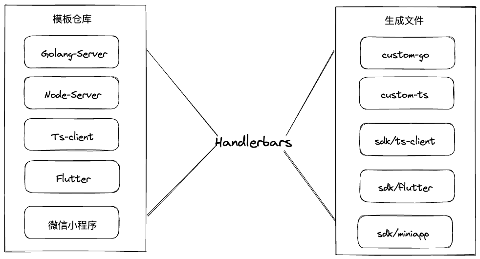

# SDK模板生成文档

## 一、HandlerBars介绍

官网：https://handlebarsjs.com/zh/guide/

> Handlebars 是一种简单的 **模板语言**。
>
> 它使用模板和输入对象来生成 HTML 或其他文本格式。Handlebars 模板看起来像常规的文本，但是它带有嵌入式的 Handlebars 表达式 。
>
> ```
><p>{{firstname}} {{lastname}}</p>
> ```
> 
> Handlebars 表达式是一个 `{{`，一些内容，后跟一个 `}}`。执行模板时，这些表达式会被输入对象中的值所替换。

在飞步的钩子模板和客户端模板中，我们使用Handlerbars模板引擎来生成对应的模板文件。

为什么要使用Handlerbars?

- 社区活跃度较高，使用比较成熟，github 上已有17.3k的star数
- 基于表达式嵌入，比较方便嵌入我们自定义的变量
- 可以定义块助手代码，从而可以实现例如去重、过滤、列表等灵活的功能
- 可以使用代码片段进行复用，这对于模板代码十分有用

## 二、与飞布的集成

对于想要了解飞布是如何与Handlerbars进行集成的开发者，可以先花几分钟时间了解一下Handlerbars的用法，以及我们该如何在代码中进行渲染模板，这里是golang的`Handlerbars`包：

https://github.com/flowchartsman/handlebars

以该仓库中的代码作为示例：

```go
package main

import (
    "fmt"

    "github.com/flowchartsman/handlebars/v3"
)

func main() {
    tpl := `<div class="entry">
  <h1>{{title}}</h1>
  <div class="body">
    {{body}}
  </div>
</div>
`

    ctx := map[string]string{
        "title": "My New Post",
        "body":  "This is my first post!",
    }

    result, err := handlebars.Render(tpl, ctx)
    if err != nil {
        panic("Please report a bug :)")
    }

    fmt.Print(result)
}
```

输出如下：

```html
<div class="entry">
  <h1>My New Post</h1>
  <div class="body">
    This is my first post!
  </div>
</div>
```

使用模板引擎最关键的元素有两个：

- 模板文件/代码片段【可以是HTML/JS/TypeScript/Golang/... 任何符合 Handlerbars规范的文本或`hbs`文件】
- 模板上下文 【为 template 提供环境变量，助手代码函数等】

在这个示例中 ctx 提供了`title`和`body`两个变量，渲染了模板代码段中的表达式。上下文可以是最基本的包含了键值对的map集合，也可以自定义一个结构体来进行渲染。这一点可以参考[Handlerbars官网](https://handlebarsjs.com/zh/guide/#%E7%AE%80%E5%8D%95%E7%9A%84%E8%A1%A8%E8%BE%BE%E5%BC%8F):link:上的示例，官网提供了直接在 web 浏览器中渲染 Handlerbars 的功能。

飞布的底层代码则要复杂得多，我们致力于生成一个可运行的 go 项目或者 ts 项目，那么必不可少的需要使用到 Handlerbars 的诸多功能特性，来保障我们的代码逻辑。飞布通过这样的方式使得开发者只需下载模板就可以自动生成规范的项目，按照飞布的规范来编写代码，减少了学习成本和使用成本。



**飞布的产品手册中对模板的变量有说明：https://docs.fireboom.io/v/v1.0/er-ci-kai-fa/mo-ban-gui-fan**

**根据手册中的说明内容，当我们了解了HandlerBars的使用和模板规范后，甚至可以尝试在此基础上自己开发一套模板，来支持想要的编程语言**


## 三、案例

在飞布的官方文档中有这样的案例，其中以代码示例的方式较为详细地说明了如何去使用HandlerBars渲染模板：[飞布 ｜ Java生成对象定义](https://ansons-organization.gitbook.io/product-manual/er-ci-kai-fa/zi-ding-yi-mo-ban#java-sheng-cheng-dui-xiang-ding-yi)

我们以飞布如何生成API的出入参`models`为例，参照代码说明一下模板的生成过程【这里不详细说明飞布的源码，重点讲解一下Handlerbars的使用】：

在飞布项目中，我们可以从控制台下载服务端/客户端钩子模板，以`golang-server`为例，下载的模板文件中files/generated/models.go.hbs文件如下：

```handlebars
package generated

{{#each objectFieldArray}}
type {{upperFirst (joinString '_' documentPath)}} struct {
    {{#each fields}}
    {{upperFirst (trimPrefix name '_')}} {{#if isArray}}[]{{~/if~}}
    {{~#if typeRefObject~}}
        {{#if typeRefObject.isDefinition}}*{{/if}}{{~upperFirst (joinString '_' typeRefObject.documentPath)~}}
    {{~else~}}
        {{~#if typeRefEnum~}}
            {{~upperFirst typeRefEnum.name~}}
        {{~else~}}
            {{~#equal typeName 'string'}}string{{/equal~}}
            {{~#equal typeName 'integer'}}int64{{/equal~}}
            {{~#equal typeName 'number'}}float64{{/equal~}}
            {{~#equal typeName 'boolean'}}bool{{/equal~}}
            {{~#equal typeName ''}}any{{/equal~}}
        {{~/if}}
    {{~/if}} `json:"{{name}}{{#unless required}},omitempty{{/unless}}"`
    {{/each}}
}
{{/each}}

{{#each enumFieldArray}}
type {{upperFirst name}} string
const (
    {{#each values}}
    {{upperFirst name}}_{{this}} {{upperFirst name}} = "{{this}}"
    {{/each}}
)
{{/each}}
```

### 1.基础语法

- `{{#each}}{{/each}}` 遍历传递进来的变量，通过飞布创建API后，飞布需要根据定义的`graphql`自动生成 API 的出入参，这里的`objectFieldArray`和`enumFieldArray`就是飞布源码中定义的上下文环境变量：

  ```go
  type templateContext struct{
    ...
    EnumFieldArray   []*enumField   // 枚举类型定义
    ObjectFieldArray []*objectField // 对象类型定义
  }
  
  objectField struct {
    Name          string         // 对象/字段名
    TypeName      string         // 类型名(为字段时使用)
    TypeRef       string         // 忽略
    TypeRefObject *objectField   // 类型引用(为字段时使用)
    TypeRefEnum   *enumField     // 枚举引用(为字段时使用)
    Required      bool           // 是否必须(为字段时使用)
    IsArray       bool           // 是否数组(为字段时使用)
    IsDefinition  bool           // 是否全局定义
    DocumentPath  []string       // 文档路径(建议拼接后用来做对象名/字段类型名)
    Fields        []*objectField // 字段列表(为对象时使用)
    Root          string         // 顶层归属类型(Input/InternalInput/ResponseData/Definitions)
    OperationInfo *operationInfo // operation信息
  }
  ```

  通过遍历`objectFieldArray`可以获得出入参的元数据构建models

- `{{#/if}}{{else}}{{/if}}` 可以用来判断某些条件是否满足或者传入的变量是否为空，需要注意的是 Handlerbars 的语法可能区别于一般的编程语言，中间的`{{else}}`是可选的，并且如果需要`{{else}}`，则必须置于一对`{{#if}}{{/if}}`中间

- `{{#equal}}`接收两个参数，用来判等

- `~`空格控制，通过在括号中添加一个 `~` 字符，可以从模板代码块的任何一侧省略模板中的空格。应用之后，该侧的所有空格将被删除，直到第一个位于同一侧的 Handlebars 表达式或非空格字符出现。

### 2.助手代码

示例用法：`{{#upperFirst (joinString '_' documentPath)}}`

自定义助手代码

  ```go
handlebars.RegisterHelper("upperFirst", func(str string) string {
  strLen := len(str)
  if strLen == 0 {
    return ""
  }

  result := strings.ToUpper(str[:1])
  if strLen > 1 {
    result += str[1:]
  }
  return result
})

handlebars.RegisterHelper("joinString", func(sep string, strArr []string) string {
  return strings.Join(strArr, sep)
})
  ```

  `upperFirst`助手代码可以将其后的字符串变量首字母大写

  `joinString`助手代码可以接收一个分隔符和字符串数组，将字符串进行拼接

**飞布目前已注册的助手代码有哪些？**

| 助手代码名称   | 功能说明                                                     |
| -------------- | ------------------------------------------------------------ |
| subStringAfter | 返回指定分隔符之后的字符串，例如 {{subStringAfter 'hello, world'  ','}} 将被渲染成world |
| trimPrefix     | 等同于strings.TrimPrefix，去除前缀                           |
| length         | 获取字符串长度                                               |
| lowerFirst     | 使字符串首字母小写                                           |
| upperFirst     | 使字符串首字母大写                                           |
| stringInArray  | 判断字符串是否存在于数组中                                   |
| joinString     | 接收一个分隔符和字符串数组，将字符串进行拼接                 |
| equalAny       | 判断是否满足任意一个，例如{{euqalAny 'hello' 'hello, world'}} 将渲染成true |
| isNotEmpty     | 判断是否为零值                                               |
| invertBool     | 反转bool值，非操作                                           |
| startWith      | 接收一个字符串和一个前缀，判断字符串是否以该前缀开头         |
| isAllTrue      | 接收可选的多个Bool类型参数，判断是否全为真，与操作           |
| isAnyTrue      | 接收可选的多个Bool类型参数，判断是否有任意一个为真，或操作   |
| ......         | ......                                                       |

**这里[🔗手册](https://docs.fireboom.io/v/v1.0/er-ci-kai-fa/mo-ban-gui-fan)有更详尽的说明**

