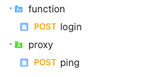
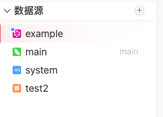
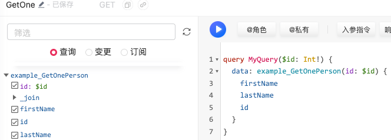
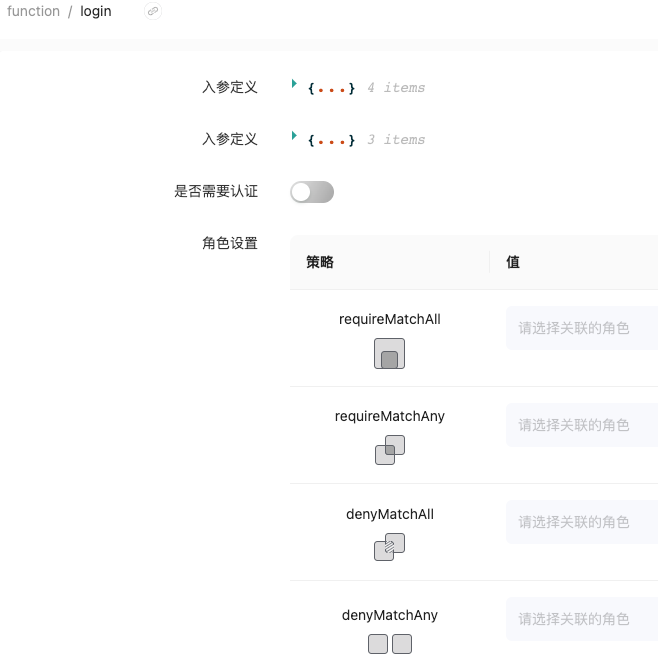

# 自定义数据源

> 数据源的概念：指存储和提供数据的位置或系统。它可以是各种类型的数据库、文件系统、API、数据仓库等。数据源提供对数据的访问和操作接口，使应用程序能够读取、写入、更新和删除数据。
>
> 飞布支持多种形式的数据源，包括传统的MySQL、SqlLite等数据库，还支持从上传的openApi格式的json文件编译出超图【REST数据源】，这些相信大部分开发者都能理解，还有一种特殊的数据源，也可以称之为飞布提供的三种扩展机制，那就是graphql、function、proxy，低代码平台一般都会在提供便利的同时丧失了一定的灵活性，飞布在这点上为开发者提供了扩展机制，可以自定义一些数据源/API，完成一些低代码无法完成的复杂任务
>
> 本文所讲的三种自定义数据源都是在使用钩子模板的基础上，请结合钩子模板来学习


首先附上钩子模板（以golang-server为例）的目录结构

```go
custom-go
├── customize           // graphql数据源
│   ├── example.go
│   └── example.json    // 启动钩子模板后自动生成的配置文件
├── function						// function数据源
│   ├── login.go        
│   └── login.json      // 启动钩子模板后自动生成的配置文件
├── generated           // 自动生成的目录，包含一些配置数据
│   ├── fireboom.config.json       
│   ├── fireboom.operations.json
│   ├── fireboom_hooks.go
│   └── models.go
├── global              // 打开飞布全局钩子就会生成这个目录
│   └── beforeOriginRequest.go  // 全局钩子--在所有请求之前执行
├── go.mod
├── go.sum
├── helix.html
├── main.go
├── pkg
│   ├── base
│   ├── consts
│   ├── embeds
│   ├── plugins
│   ├── types
│   ├── utils
│   └── wgpb
├── proxy            // proxy数据源
│   ├── ping.go
│   └── ping.json 	 // 启动钩子模板后自动生成的配置文件
├── scripts
├── server
└── storage

```


## 1. GraphQL数据源

什么是GraphQL: https://graphql.cn/learn/

简单来说，它就是一种用于 API 的查询语言。我们在使用飞布的超图面板进行创建API的时候就是使用的GraphQL语法。

什么又是Graphql数据源呢？

在钩子模板中，支持使用代码编程式地创建Graphql数据源，示例如下【customize/example.go】：

```go
package customize

import (
	"custom-go/pkg/plugins"
	"github.com/graphql-go/graphql"
	"log"
	"time"
)

type Person struct {
	Id        int    `json:"id"`
	FirstName string `json:"firstName"`
	LastName  string `json:"lastName"`
}

var testPeopleData = []Person{
	{Id: 1, FirstName: "John", LastName: "Doe"},
	{Id: 2, FirstName: "Jane", LastName: "Doe"},
}
var personType = graphql.NewObject(graphql.ObjectConfig{
	Name: "Person",
	Fields: graphql.Fields{
		"id":        &graphql.Field{Type: graphql.Int},
		"firstName": &graphql.Field{Type: graphql.String},
		"lastName":  &graphql.Field{Type: graphql.String},
	},
})

var (
	queryFields = graphql.Fields{
		"GetOnePerson": &graphql.Field{
			Type: personType,
			Args: graphql.FieldConfigArgument{
				"id": &graphql.ArgumentConfig{
					Type: graphql.Int,
				},
			},
			Resolve: func(params graphql.ResolveParams) (res interface{}, err error) {
				_, _, err = plugins.ResolveArgs[any](params)
				if err != nil {
					return
				}
				id, ok := params.Args["id"].(int)
				if ok {
					for _, p := range testPeopleData {
						if p.Id == id {
							return p, nil
						}
					}
				}
				return "ok", nil
			},
		},
	}

	mutationFields = graphql.Fields{
		"UpdateOnePerson": &graphql.Field{
			Type: personType,
			Args: graphql.FieldConfigArgument{
				"id": &graphql.ArgumentConfig{
					Type: graphql.Int,
				},
				"firstName": &graphql.ArgumentConfig{
					Type: graphql.String,
				},
				"lastName": &graphql.ArgumentConfig{
					Type: graphql.String,
				},
			},
			Resolve: func(params graphql.ResolveParams) (interface{}, error) {
				_ = plugins.GetGraphqlContext(params)
				id, ok := params.Args["id"].(int)
				if ok {
					for _, p := range testPeopleData {
						if p.Id == id {
							firstName, ok := params.Args["firstName"].(string)
							if ok {
								p.FirstName = firstName
							}

							lastName, ok := params.Args["lastName"].(string)
							if ok {
								p.LastName = lastName
							}
							return p, nil
						}
					}
				}
				return nil, nil
			},
			Description: "Update Person By Id",
		},
	}

	subscriptionFields = graphql.Fields{
		"SubscriptionPerson": &graphql.Field{
			Type: personType,
			Resolve: func(params graphql.ResolveParams) (interface{}, error) {
				return params.Source, nil
			},
			Subscribe: func(params graphql.ResolveParams) (interface{}, error) {
				c := make(chan interface{})

				go func() {
					var i int
					for {
						i++
						person := Person{Id: i, FirstName: "John", LastName: "Doe"}

						select {
						case <-params.Context.Done():
							log.Println("[RootSubscription] [Subscribe] subscription canceled")
							close(c)
							return
						default:
							c <- person
						}

						time.Sleep(250 * time.Millisecond)

						if i == 21 {
							close(c)
							return
						}
					}
				}()

				return c, nil

			},
		},
	}
)

// 通过graphql.NewSchema 可以创建多种类型的API,每种类型我们可以自定义入参和出参结构,编写Resovle函数作为API的具体执行逻辑
var ExampleSchema, _ = graphql.NewSchema(graphql.SchemaConfig{
	Query: graphql.NewObject(graphql.ObjectConfig{
		Name:   "query",
		Fields: queryFields,
	}),
	Mutation: graphql.NewObject(graphql.ObjectConfig{
		Name:   "mutation",
		Fields: mutationFields,
	}),
	Subscription: graphql.NewObject(graphql.ObjectConfig{
		Name:   "subscription",
		Fields: subscriptionFields,
	}),
})

func init() {
	plugins.RegisterGraphql(&ExampleSchema)
}
```

## 2. Proxy数据源

proxy意为代理，即我们可以自己注册接口给飞布，由飞布生成路由并代理执行

示例代码如下：

```go
package proxy

import (
	"custom-go/pkg/base"
	"custom-go/pkg/plugins"
	"custom-go/pkg/wgpb"
	"net/http"
)

func init() {
  // 通过传入wgpb.OperationType_MUTATION枚举字段，给API设置为变更即POST请求
  // 还可以传入
  // OperationType_QUERY代表查询请求--GET
  // OperationType_SUBSCRIPTION代表订阅--GET
	plugins.RegisterProxyHook(ping, wgpb.OperationType_MUTATION)
}

func ping(hook *base.HttpTransportHookRequest, body *plugins.HttpTransportBody) (*base.ClientResponse, error) {
	// do something here ...
	body.Response = &base.ClientResponse{
		StatusCode: http.StatusOK,
	}
	body.Response.OriginBody = []byte("ok")
	return body.Response, nil
}
```

## 3. Function数据源

其实有了上面两种扩展就基本上可以满足开发需求了，Function数据源和Proxy数据源的区别在于，Proxy是完全代理模式，飞布作为代理方只是添加了路由，具体执行完全交给开发者，我们也不会知道这个接口需要的入参和出参，相比之下，**Function是规定了入参和出参的**，我们看一下示例代码的方法签名就一目了然了：

```go
package function

import (
	"custom-go/pkg/base"
	"custom-go/pkg/plugins"
	"custom-go/pkg/wgpb"
)

func init() {
	plugins.RegisterFunction[loginReq, loginRes](login, wgpb.OperationType_MUTATION)
}

type loginReq struct {
	Username string    `json:"username"`
	Password string    `json:"password"`
	Info     loginInfo `json:"info,omitempty"`
}

type loginInfo struct {
	Code    string `json:"code,omitempty"`
	Captcha string `json:"captcha,omitempty"`
}

type loginRes struct {
	Msg  string `json:"msg"`
	Data string `json:"data"`
}

// 这里采用了泛型的方式，飞布会根据传入的结构体进行解析出符合规范的json格式，这样也方便在web界面上查看
func login(hook *base.HookRequest, body *base.OperationBody[loginReq, loginRes]) (*base.OperationBody[loginReq, loginRes], error) {
	if body.Input.Username != "John" || body.Input.Password != "123456" {
		body.Response = &base.OperationBodyResponse[loginRes]{
			Errors: []base.GraphQLError{{Message: "username or password wrong"}},
		}
		return body, nil
	}

	body.Response = &base.OperationBodyResponse[loginRes]{Data: loginRes{Msg: "login success"}}
	return body, nil
}
```

## 4. 如何在自定义的逻辑中调用已有的飞布接口？

可以在钩子模板服务中使用以下方式进行调用已有的飞布接口，使用场景：比如现在我们需要做登录接口，在这个接口中，我们需要做三件事：

- 查询用户的登录密码是否正确，返回错误提示或者返回token
- 写库保存用户的登录记录，更新网站日活用户数量
- 查询用户的基础信息，如头像、昵称、接口权限列表等

这三个接口我们已经通过飞布创建出来了，那我们可以在代码中显式调用（类似于RPC，但是这里我们调用的是本地的飞布服务接口）：

```go
// 执行内部变更接口，I代表入参input类型， OD代表出参outputData类型， path是接口的路由路径 【这些结构体都会由飞布自动生成，拿来直接调用就好】
func ExecuteInternalRequestMutations[I, OD any](internalClient *base.InternalClient, path base.OperationMutationPath, input I) (result OD, err error) {
	return executeInternalRequest[I, OD](internalClient.Context, internalClient.Mutations, path, input)
}

// 执行内部查询接口
func ExecuteInternalRequestQueries[I, OD any](internalClient *base.InternalClient, path base.OperationQueryPath, input I) (result OD, err error) {
	return executeInternalRequest[I, OD](internalClient.Context, internalClient.Queries, path, input)
}
```

## 5. 如何查看自定义的数据源是否生效?

如果发现没有生效，首先看看自己有没有在入口文件`main.go`中引入：

```go
package main

import (
	_ "custom-go/customize"
	_ "custom-go/function"
	_ "custom-go/proxy"
	"custom-go/server"
)

func main() {
	server.Execute()
}
```

在飞布的Web界面中--API设计栏目中有显示Proxy和Function目录，该目录下会展示生成的自定义接口：



可以在swagger界面或者使用API调试工具如Postman进行调试相关接口

GraphQL数据源较其他两种有些不同，会直接在web界面展示数据源，我们可以像使用普通数据源那样通过超图面板点选生成接口：





## 6. 自定义数据源可以被RBAC权限模型控制嘛？

可以。自定义的数据源或者生成的接口都是可以通过web界面控制RBAC权限的。

- GraphQL数据源：由于是正常的通过超图面板点选生成的接口，和普通接口一样使用即可

- Proxy和Function：有单独的修改入口

   

  